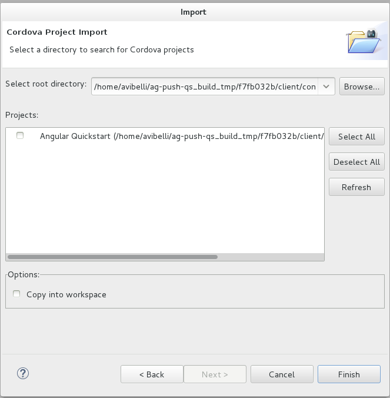
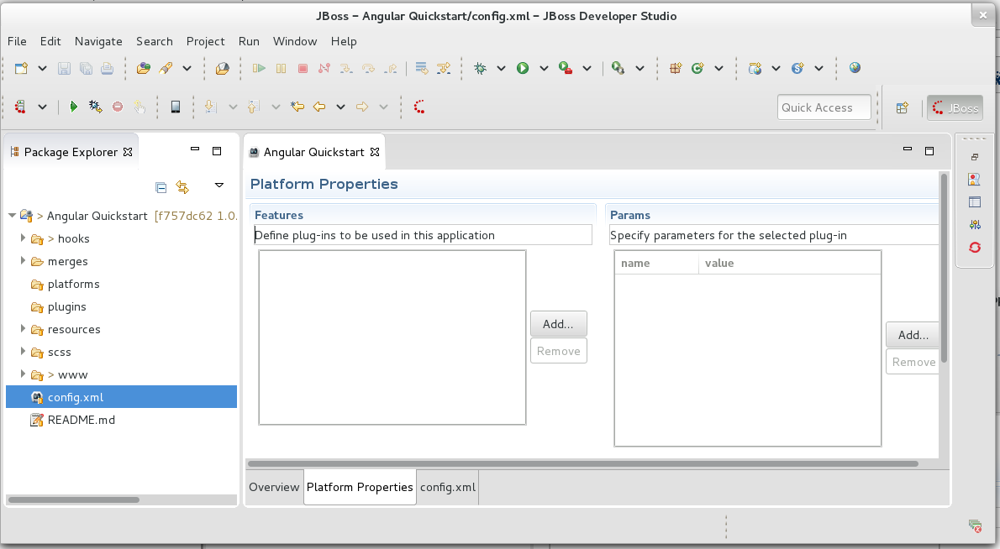
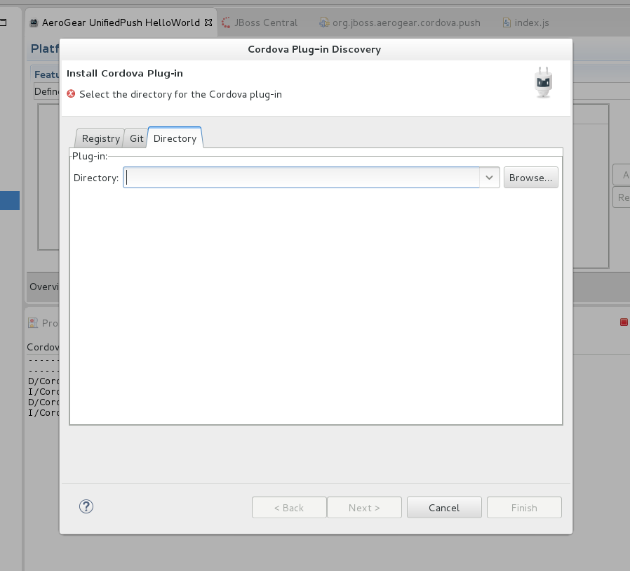

push-contacts-mobile-cordova: Push Contacts Mobile Cordova
===========================
Author: Erik Jan de Wit (edewit)  
Level: Intermediate  
Technologies: JavaScript Cordova  
Summary: A contacts CRUD mobile application with push notification integration.  
Target Product: JBoss Unified Push   
Versions: 1.0  
Source: <https://github.com/jboss-developer/jboss-mobile-quickstarts/>  

## What is it?

This quickstart demonstrates how to develop more advanced Cordova push applications, centered around a CRUD contacts application.

This client-side Cordova project must be used in conjunction with the `push-contacts-mobile/server/push-contacts-mobile-picketlink-secured` application, which provide the accompanying server-side functionality.  

When the client application is deployed to an Android or iOS device, the push functionality enables the device to register with the running JBoss Unified Push Server OpenShift instance and receive push notifications. The server-side application provides login authentication for the client application and sends push notification requests to the Unified Push Server OpenShift instance in response to new contacts being created. Push notifications received by the Android or iOS device contain details of newly added contacts.

## How do I run it?

### 0. System requirements

The Cordova command line tooling is based on node.js so first you'll need to [install node](http://nodejs.org/download/), then you can install Cordova by executing:

        npm install -g cordova

To deploy on iOS you need to install the ios-deploy package as well

        npm install -g ios-deploy

#### iOS

For iOS you'll need a valid provisioning profile as you will need to test on an actual device (push notification is not available when using a simulator).
Replace the bundleId with your bundleId (the one associated with your certificate), by editing the config.xml at the root of this project, change the id attribute of the `widget` node. After that run a `cordova platform rm ios` followed by `cordova platform add ios` to change the Xcode project template.

If you want to change your bundleId later on, you will still have to run a `cordova platform rm ios` followed by `cordova platform add ios` to change the Xcode project template.

#### Android

To deploy and run Cordova applications on Android the Apache Ant tool needs to be [installed](http://ant.apache.org/manual/install.html).

### 1. Register Application with Push Services

For the configuration and registration of Android or iOS Applications with PushServices, please refer to the specific guides inside *push-contacts-mobile-android* and *push-contacts-mobile-ios* quickstarts.

### 2. Customize and Build Application

There are 2 examples for Cordova; one is built using [jquery mobile](jqm) and one with [angular](angular). The READMEs located in these directories will direct you to the settings you'll need to change to setup push notifications.

### 3. Install platforms

After changing the push configuration you can install the platforms you want on the Cordova app. JBoss Unified Push for Cordova currently supports Android and iOS.

        cordova platform add <android or ios>

### 4. Add JBoss Unified Push Cordova Push plug-in

You now need to add the plugin to the Cordova app.

        cordova plugin add `QUICKSTART_HOME/push-contacts-mobile/client/push-contacts-mobile-cordova/cordova_pushplugin/org.jboss.aerogear.cordova.push`

### 5. Test the Application

#### 0. Prerequisites

1. The Unified Push Server OpenShift instance must be running before the application is deployed to ensure that the device successfully registers with the Unified Push Server on application deployment.
2. The `push-contacts-mobile/server/push-contacts-mobile-picketlink-secured` application must be running before attempting to log into the mobile client application to ensure successful login. For more information, see the README distributed with the `push-contacts-mobile-picketlink-secured` application.

#### 1. Deploy for Testing

The application can be tested on physical Android or iOS devices only; push notifications are not available for Android emulators nor iOS simulators. To deploy, run and debug the application on an Android or iOS device attached to your system, on the command line enter the following:

        cordova run <android or ios>

#### 2. Log In

For the _Log In_ procedure on Android or iOS devices, please refer to the specific guides inside *push-contacts-mobile-android* and *push-contacts-mobile-ios* quickstarts.

#### 3. Send a Push Message

For the _Send a Push Message_ procedure on Android or iOS devices, please refer to the specific guides inside *push-contacts-mobile-android* and *push-contacts-mobile-ios* quickstarts.

## Run the Quickstart in JBoss Developer Studio or Eclipse

Import the generated project into JBDS:  

Select the project location and project and click `Finish`:  

In the newly imported project, open the `config.xml` file and click `Add...` in the `Features` section:  

Choose `Directory` and point to the directory containing your plugin, then click `Finish`:  

Run the project on a device:  

Debug the Application
=====================

1. Start a browser Chrome for Android or Safari for iOS

2. Follow the instructions for the mobile device

   * For iOS

        Develop -> &lt;device name> -> index.html

   * For Android

        Menu -> Tools -> Inspect Devices -> inspect

