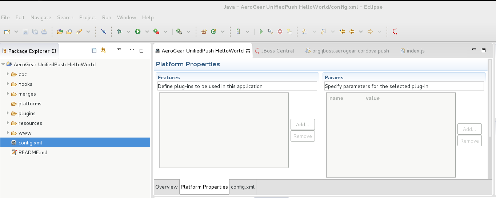

push-helloworld-cordova: Push Helloworld Cordova
===========================
Author: Erik Jan de Wit (edewit)   
Level: Beginner   
Technologies: JavaScript Cordova   
Summary: A basic example of Push : Registration and receiving messages.   
Target Product: JBoss Unified Push   
Versions: 1.0   
Source: <https://github.com/jboss-developer/jboss-mobile-quickstarts/>  

## What is it?

This quickstart demonstrates how to include basic push functionality in Cordova applications using the JBoss Unified Push Cordova Push plug-in.

This simple project consists of a ready-to-build Cordova application. Before building the application, you must register the Android or iOS variant of the application with a running JBoss Unified Push Server OpenShift instance and Google Cloud Messaging for Android or Apple Push Notification Service for iOS. The resulting unique IDs and other parameters must then be inserted into the application source code. After this is complete, the application can be built and deployed to Android or iOS devices.

When the application is deployed to an Android or iOS device, the push functionality enables the device to register with the running JBoss Unified Push Server instance and receive push notifications.

## How do I run it?

### 0. System requirements

The Cordova command line tooling is based on node.js so first you'll need to [install node](http://nodejs.org/download/), then you can install Cordova by executing:

        npm install -g cordova

To deploy on iOS you need to install the ios-deploy package as well

        npm install -g ios-deploy

#### iOS

For iOS you'll need a valid provisioning profile as you will need to test on an actual device (push notification is not available when using a simulator).
Replace the bundleId with your bundleId (the one associated with your certificate), by editing the config.xml at the root of this project, change the id attribute of the `widget` node. After that run a `cordova platform rm ios` followed by `cordova platform add ios` to change the Xcode project template.

If you want to change your bundleId later on, you will still have to run a `cordova platform rm ios` followed by `cordova platform add ios` to change the Xcode project template.

#### Android

To deploy and run Cordova applications on Android, the Apache Ant tool needs to be [installed](http://ant.apache.org/manual/install.html).

### 1. Register Application with Push Services

For the configuration and registration of Android or iOS Applications with push services, please refer to the specific guides inside *push-helloworld-android* and *push-helloworld-ios* quickstarts.

### 2. Customize and Build Application

In `www/push-config.json` change `pushServerURL` with the url of your JBoss Unified Push Server OpenShift instance. You also need to change `senderID`, `variantID` and `variantSecret` with the values assigned by JBoss Unified Push Server OpenShift instance and GCM or APNS:

        {
           "pushServerURL": "<pushServerURL e.g https://{OPENSHIFT_UNIFIEDPUSHSERVER_URL}/ag-push >",
           "android": {
              "senderID": "<senderID e.g Google Project ID only for android>",
              "variantID": "<variantID e.g. 1234456-234320>",
              "variantSecret": "<variantSecret e.g. 1234456-234320>"
           },
           "ios": {
              "variantID": "<variantID e.g. 1234456-234320>",
              "variantSecret": "<variantSecret e.g. 1234456-234320>"
           }
        }

**Note:** You can also copy/paste these settings from your JBoss Unified Push Server console

### 3. Install platforms

After changing the push configuration you can install the platforms you want on the Cordova app. JBoss Unified Push for Cordova currently supports Android and iOS.

        cordova platform add <android or ios>

### 4. Add JBoss Unified Push Cordova Push plug-in

You now need to add the plugin to the Cordova app.

        cordova plugin add `QUICKSTART_HOME/cordova_pushplugin/org.jboss.aerogear.cordova.push`

### 5. Test the Application

The application can be tested on physical Android or iOS devices only; push notifications are not available for Android emulators nor iOS simulators. To deploy, run and debug the application on an Android or iOS device attached to your system, on the command line enter the following:

        cordova run <android or ios>

#### Send a Push Message

You can send a push notification to your device using the JBoss Unified Push Server console by completing the following steps:

1. Log into the JBoss Unified Push Server OpenShift instance console.
2. Click `Send Push`.
3. From the `Applications` list, select the application.
4. In the `Messages` field, type the text to be sent as the push notification.
5. Click `Send Push Notification`.

## How does it work?

### Registration

When you start the application Cordova will fire a `deviceready` event when Cordova initialization is done and the device is ready (see `www/js/index.js`). On this event the `register` function will be executed registering the device with the JBoss Unified Push Server. The first argument is a function that gets executed when the device receives a push event, followed by a success and errorCallback that are invoked when the registration was successful or not and the last parameter is the push configuration that indicates where the push server is located and which variant/secret to use. When registration is successful it will display this on the UI. You can also verify that the registration was successful by going to the console. A new instance will appear with your deviceId, platform and status.

## Run push-helloworld-cordova in JBoss Developer Studio or Eclipse

Import the generated project into JBDS:  

Select the project location and project and click `Finish`:  

In the newly imported project, open the `config.xml` file and click `Add...` in the `Features` section:  

Choose `Directory` and point to the directory containing your plugin, then click `Finish`:  

Run the project on a device:  

Debug the Application
=====================

1. Start a browser Chrome for Android or Safari for iOS

2. Follow the instructions for the mobile device

   * For iOS

        Develop -> device name -> index.html

   * For Android

        Menu -> Tools -> Inspect Devices -> inspect

